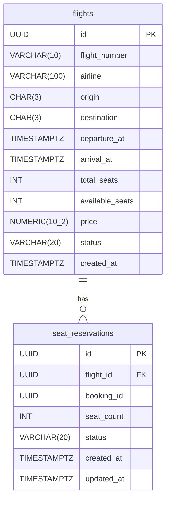
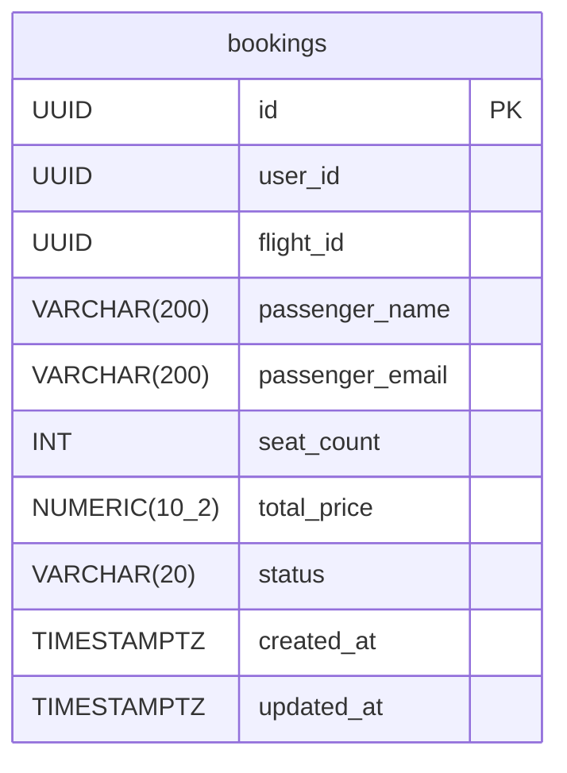
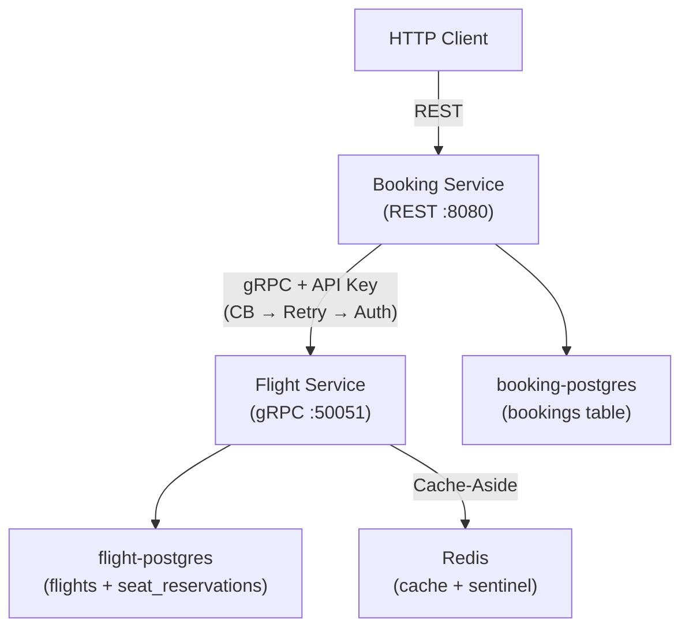

# ER Diagram — Flight Booking Microservices

## Flight Service Database

```mermaid
erDiagram
    flights {
        UUID id PK
        VARCHAR(10) flight_number
        VARCHAR(100) airline
        CHAR(3) origin
        CHAR(3) destination
        TIMESTAMPTZ departure_at
        TIMESTAMPTZ arrival_at
        INT total_seats
        INT available_seats
        NUMERIC(10_2) price
        VARCHAR(20) status
        TIMESTAMPTZ created_at
    }

    seat_reservations {
        UUID id PK
        UUID flight_id FK
        UUID booking_id
        INT seat_count
        VARCHAR(20) status
        TIMESTAMPTZ created_at
        TIMESTAMPTZ updated_at
    }

    flights ||--o{ seat_reservations : "has"
```

## Booking Service Database

```mermaid
erDiagram
    bookings {
        UUID id PK
        UUID user_id
        UUID flight_id
        VARCHAR(200) passenger_name
        VARCHAR(200) passenger_email
        INT seat_count
        NUMERIC(10_2) total_price
        VARCHAR(20) status
        TIMESTAMPTZ created_at
        TIMESTAMPTZ updated_at
    }
```

## Cross-Service Relationship

```mermaid
graph LR
    A[bookings.flight_id] -->|"gRPC reference"| B[flights.id]
    A -->|"idempotency key"| C[seat_reservations.booking_id]
```

## Architecture Overview

```mermaid
graph TB
    Client["HTTP Client"]
    BS["Booking Service\n(REST :8080)"]
    FS["Flight Service\n(gRPC :50051)"]
    BDB["booking-postgres\n(bookings table)"]
    FDB["flight-postgres\n(flights + seat_reservations)"]
    Redis["Redis\n(cache + sentinel)"]

    Client -->|"REST"| BS
    BS -->|"gRPC + API Key\n(CB → Retry → Auth)"| FS
    BS --> BDB
    FS --> FDB
    FS -->|"Cache-Aside"| Redis
```
